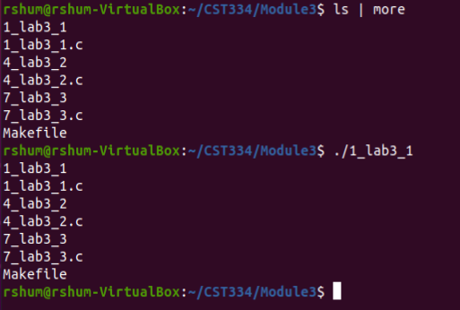
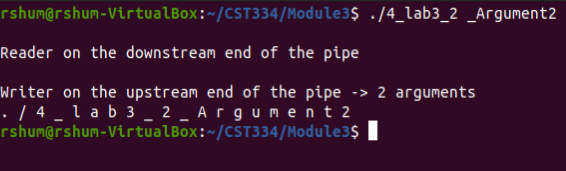
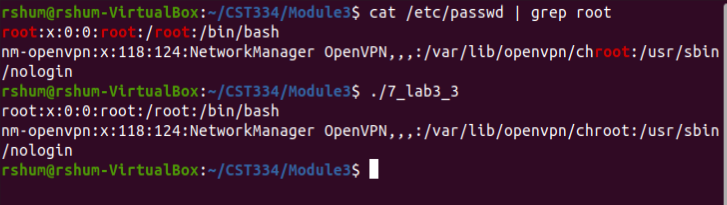

# Lab 3 - Inter-process Communication – Pipes

---

## Instructions

1. Open a bash shell in this directory.
2. Enter: <code>make all</code>
3. Run program 1: <code>./1_lab3_1.o</code>
4. Run program 2: <code>./4_lab3_2.o [ARGUMENT]</code>
5. Run program 3: <code>./7_lab3_3.o</code>

Requires: [GCC](https://linuxize.com/post/how-to-install-gcc-compiler-on-ubuntu-18-04/) 

---

## Description

This project was executed in 3 phases.

Program 1: Implements the Linux shell command: "ls | more". The program creates two child processes. The first child executes the "more" command downstream of the pipe and the second child executes "ls" upstream of the pipe. Both children close their ends of the pipe. The parent process closes both ends of the pipe and waits for both children to finish.

Program 2: A command line argument is passed through the argv[] of main(). The parent process creates two children. The first child (upstream of the pipe) writes the number of arguments passed and the contents of the arguments. The second child (downstream of the pipe) reads the arguments from stdin and writes the contents.

Program 3: This program implements the command "cat /etc/passwd | grep root" in the style of Program 1.

---

## Screen Shots

### _Program 1_

### _Program 2_

### _Program 3_

---

[Return to Main Page](https://github.com/raymondshum/CST334)
