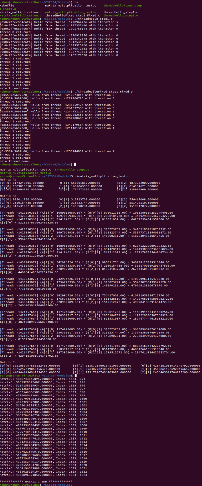

# Lab 5 - Developing multi-threaded applications
---

## Instructions

1. Open a bash shell in this directory.
2. Enter: <code>make all</code>
3. Run test 1: <code>./threadHello_step1.o</code>
4. Run program 1: <code>./threadHelloFixed_step1_Fixed.o </code>
5. Run test 2: <code>./matrix_multiplication_test.o</code>
6. Run program 2: <code>./matrix_multiplication.o</code>

---

## Description

This lab has two parts:

Part 1: We demonstrate the effect that unsynchronized and uncontrolled access to a stack-allocated variable can have on a multi-threaded program & we implement a fix by assigning the current value of the variable to a heap-allocated address per thread created.

Part 2: We implement a multi-threaded solution to perform matrix calculations on 1024 x 1024 matrices.

---

## Documentation

[Lab Write Up](./write-up.pdf)

---

## Screenshot

[Return to Main Page](https://github.com/raymondshum/CST334)
